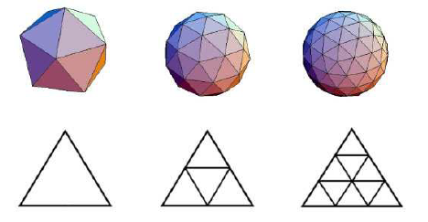

# Planet-Generation

The goal of this Unity project is to create a sphere procedurally using an icosahedron and subdividing it several time. To do so efficiently, I used compute shaders.

## The principle
There is a lot of different ways to make a sphere in a 3D engine, the issue with the "standard" sphere (where we have the same amount of points on each parallel) is that the details are concentrated on the poles. If we want to generate a planet, this is not ideal since the poles are often the least interesting part.
I focussed here on building the sphere with a different method that distributes the points more evenly on the sphere. I created an icosahedron and then subdivided each of its edges by an arbitrary integer and triangulated the faces in more smaller faces (figure \ref{icosahedron})

*Subdivision of an icosahedron \ref{icosahedron}*
